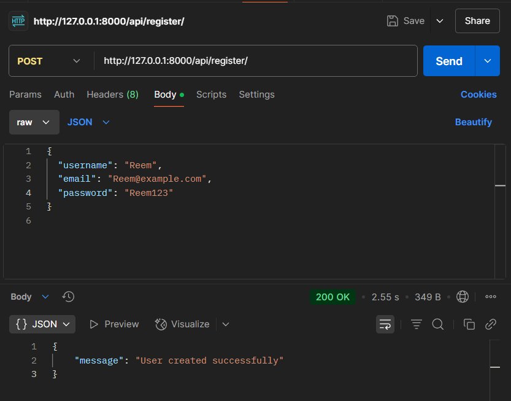
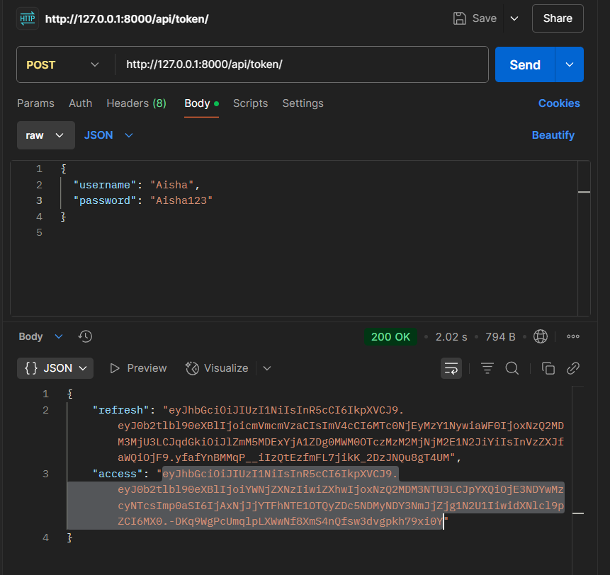
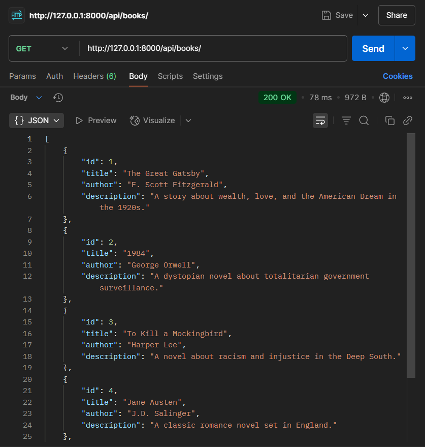
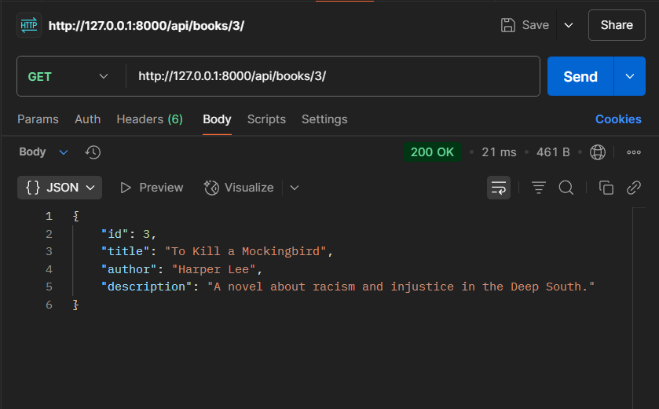
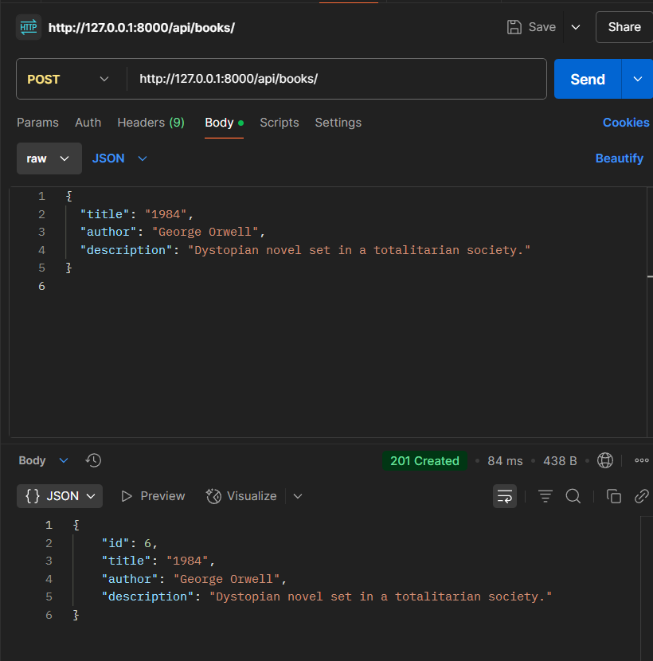
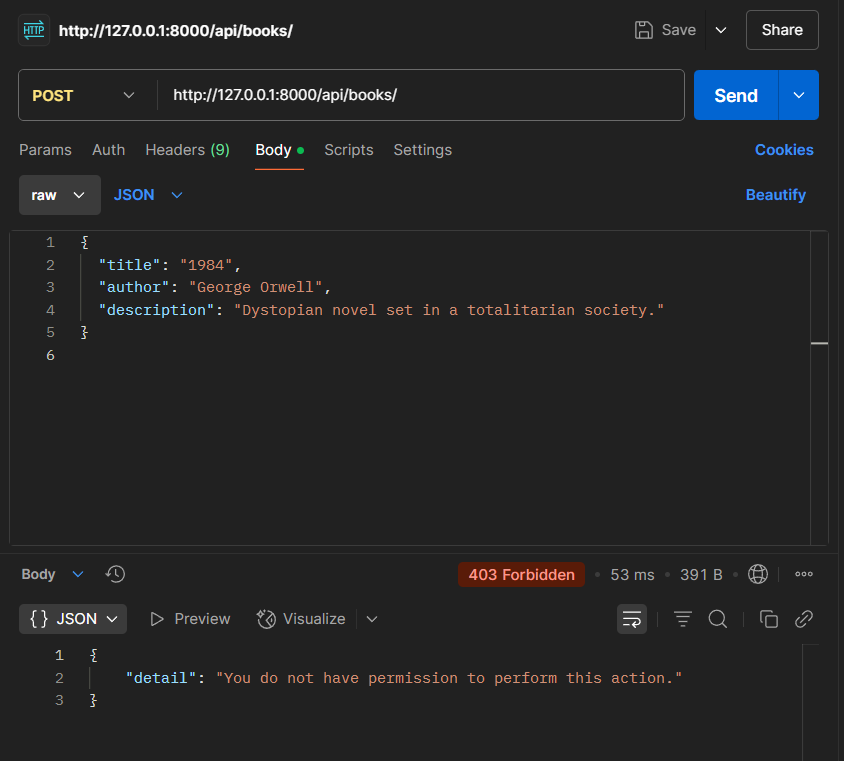
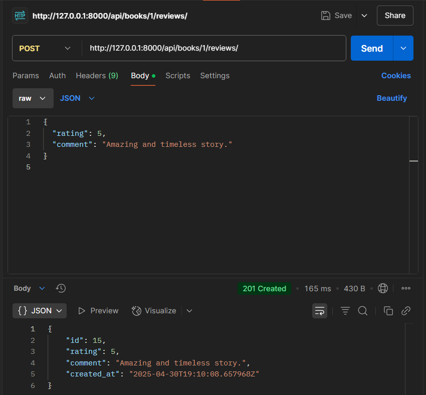
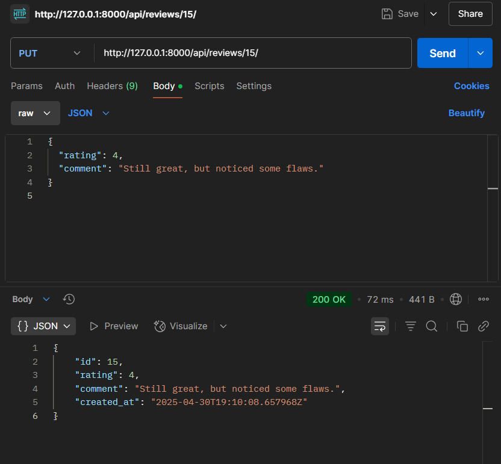
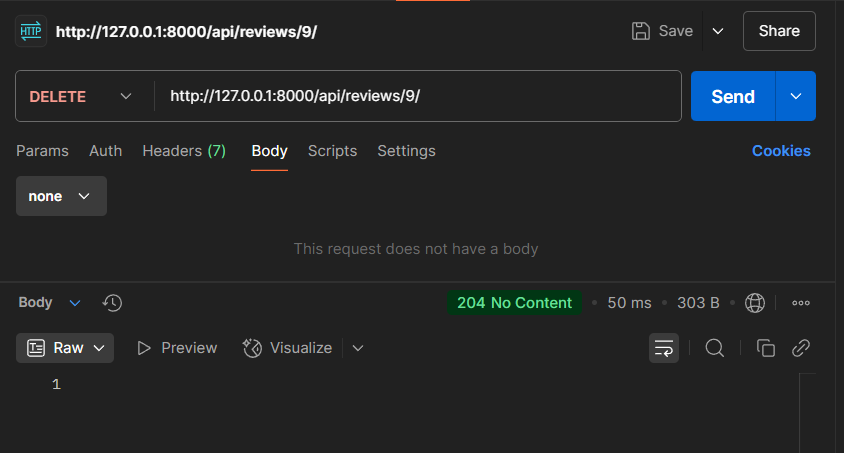

# Book Review API

RESTful API for managing books and user reviews, built with Django and Django REST Framework.

This project allows users to register, log in using JWT, browse and review books, while administrators can manage the book catalog. JWT is used for secure token-based authentication. Admin panel is enhanced with a custom dark-mode interface.

---


## 1. How to Run the Project Locally

Follow the steps below to set up and run the project on your local machine:

1. **Clone the repository**
   ```bash
   git clone https://github.com/your-username/book-review-api.git
   cd book-review-api
   ```
2. **Run migrations**   
   ```bash
   python manage.py makemigrations
   python manage.py migrate
   ```
3.**Create a superuser**     
   ```bash
   python manage.py createsuperuser
   ```
4.**Start the server**   
   ```bash
   python manage.py runserver
   ```
5.**Access the admin panel**
http://127.0.0.1:8000/admin/

---

## 2. How to Test Each Endpoint (with Postman Screenshots)

All endpoints can be tested using [Postman](https://www.postman.com/) or `curl`. Below are examples of common operations with screenshots.

> 🗂️ Make sure to include the `Authorization: Bearer <your_access_token>` header when accessing protected endpoints.

---

###  Register New User

**POST /api/register/**  
Creates a new user with username, email, and password.

 Example:


---

### Login and Get JWT Token

**POST /api/token/**  
Authenticates a user and returns an access and refresh token.

 Example:


---

### List All Books

**GET /api/books/**  
Fetches all available books.

 Example:


---

### View Book Details

**GET /api/books/<id>/**  
Displays information about a specific book.

 Example:


---

### Add a New Book (Admin Only)

**POST /api/books/**  
Allows **only admin users** to add a new book with title, author, and description.  
Regular users will receive a 403 Forbidden error.

 Example (Admin - success):


 Example (User - forbidden):

---

### Add a Review to a Book

**POST /api/books/<book_id>/reviews/**  
Allows authenticated users to post a review.

 Example:


---

###  Edit a Review (Owner Only)

**PUT /api/reviews/<review_id>/**  
Lets the original review creator edit their review.

 Example:


---

### Delete a Review (Owner Only)

**DELETE /api/reviews/<review_id>/**  
Allows the review owner to delete their review.

 Example:


---
## 3. Description of Authentication Mechanism Used


This project uses **JWT (JSON Web Token)** for stateless and secure authentication, implemented via the `djangorestframework-simplejwt` package.

### Token Workflow

- **Login via** `/api/token/`  
  Returns two tokens:
  - `access`: short-lived token (used to authenticate requests)
  - `refresh`: long-lived token (used to obtain a new access token)

- **Refresh token via** `/api/token/refresh/`

- **Use the access token in the header** of protected requests:
  ```http
  Authorization: Bearer your_access_token
  
### Permissions Overview
- Only authenticated users can add reviews

- Only review owners can edit or delete their reviews

- Only admin users can create, update, or delete books

###  How Permissions Are Enforced
 - IsAuthenticated → required to access most API endpoints

 - IsAdminUser → required for all book management actions

 - Manual ownership checks → used for update/delete actions on reviews


---

